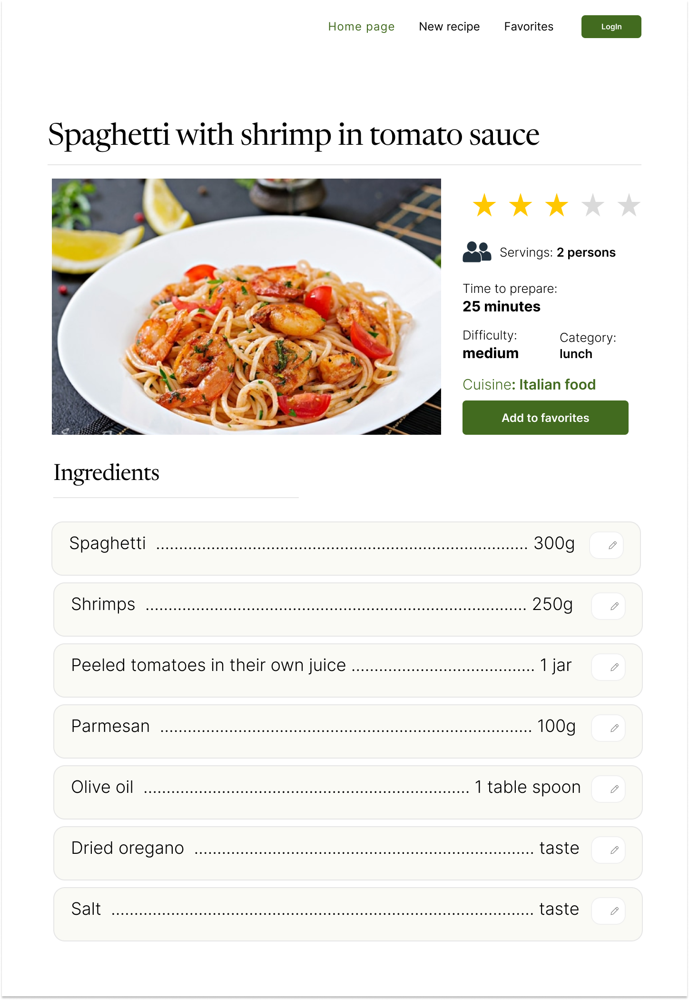

# Recipe-book

Книга рецептов - это веб-платформа, которая предлагает пользователям доступ к широкому выбору разнообразных
кулинарных рецептов. Каждый рецепт содержит информацию о необходимых ингредиентах, шагах и времени приготовления.
Платформа предоставляет возможность добавлять понравившиеся рецепты в избранное, сохранять собственные рецепты,
а также формировать список покупок для приготовления блюда.

 Визуальная схема фронтенда 

## Документация

1. Маркетинг и аналитика
   - [Целевая аудитория](./docs/marketing/target-audience.md)
   - [Заинтересанты](./docs/marketing/stakeholders.md)
   - [Пользовательские истории](./docs/marketing/user-stories.md)
   - [Функциональные требования](./docs/marketing/functional-requirements.md)
   - [Нефункциональные требования](./docs/marketing/nonfunctional-requirements.md)